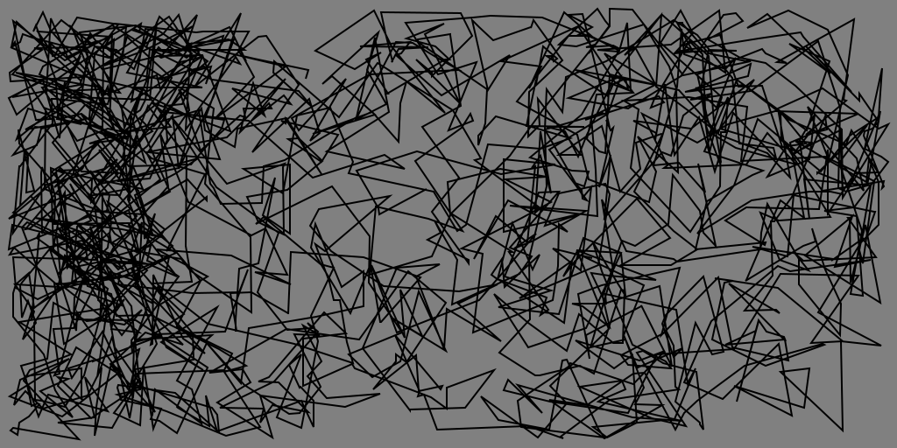

brownian-svg
==
Example generating a brownian motion svg
--



## Usage

```sh
node index.js
```

On a Mac, to open the file:

```sh
open brownian.svg
```

Your default svg / drawing program may cache the results. 
So be sure to close it before running the open command a second time.


## Steps to create this repo:

```sh
mkdir brownian-svg
cd brownian-svg
npm init -y
touch README.md
touch .gitignore
touch index.js
```